<div align="center">

# 🏥 MediNova

### Smart Healthcare Management System

*A robust, console-based healthcare platform built with Java 21 & MySQL — designed for clinical workflow management across patient records, appointments, billing, and reporting.*

[](https://openjdk.org/projects/jdk/21/)
[](https://www.mysql.com/)
[](https://dev.mysql.com/downloads/connector/j/)
[](LICENSE)
[]()
[]()

<br/>

> **MediNova** solves the fragmented record-keeping problem found in small clinics and hospitals. Built as a single-application backend system, it centralizes patient intake, doctor scheduling, medical records, billing, and reporting — eliminating paper-based workflows and reducing administrative overhead.

<br/>

[📖 Documentation](#-installation) · [🚀 Quick Start](#-quick-start) · [🗺️ Roadmap](#-roadmap) · [🤝 Contributing](#-contributing)

</div>

---


## 📸 Screenshots

|                Home Dashboard                |                Patient Management                |
| :------------------------------------------: | :----------------------------------------------: |
| 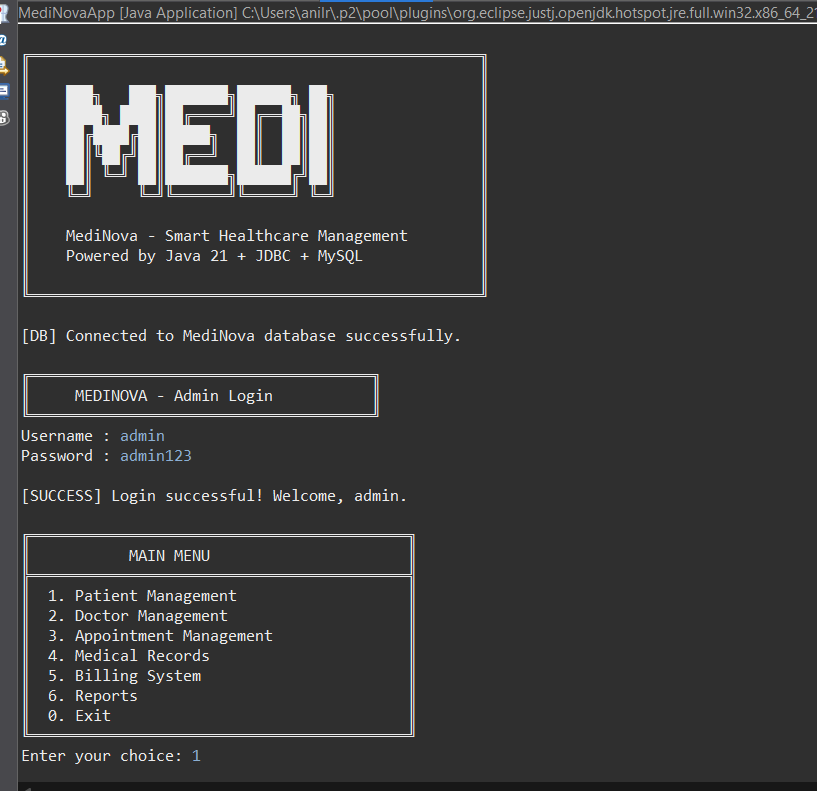 | 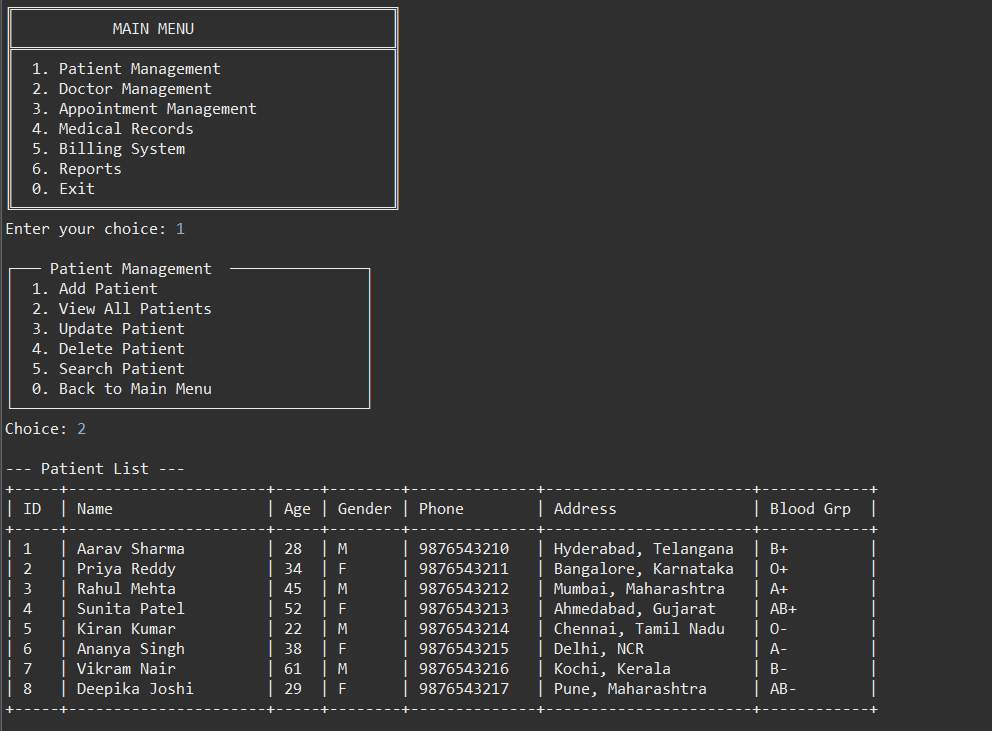 |

|                Doctor Management                |                Appointment Management                |
| :---------------------------------------------: | :--------------------------------------------------: |
| 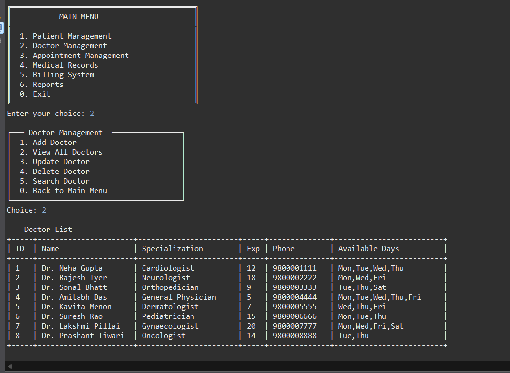 | 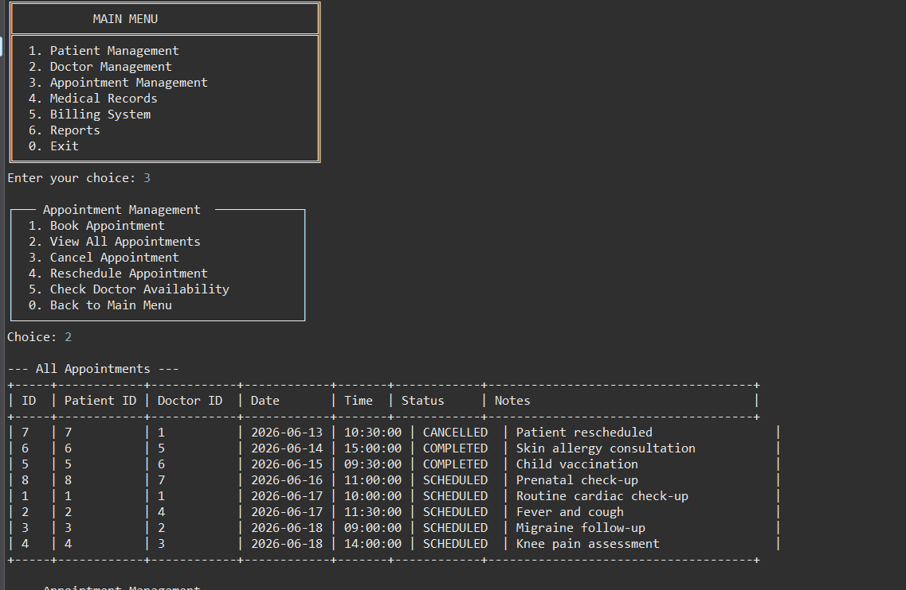 |

|                     Medical Records                    |                 Billing System                |
| :----------------------------------------------------: | :-------------------------------------------: |
| 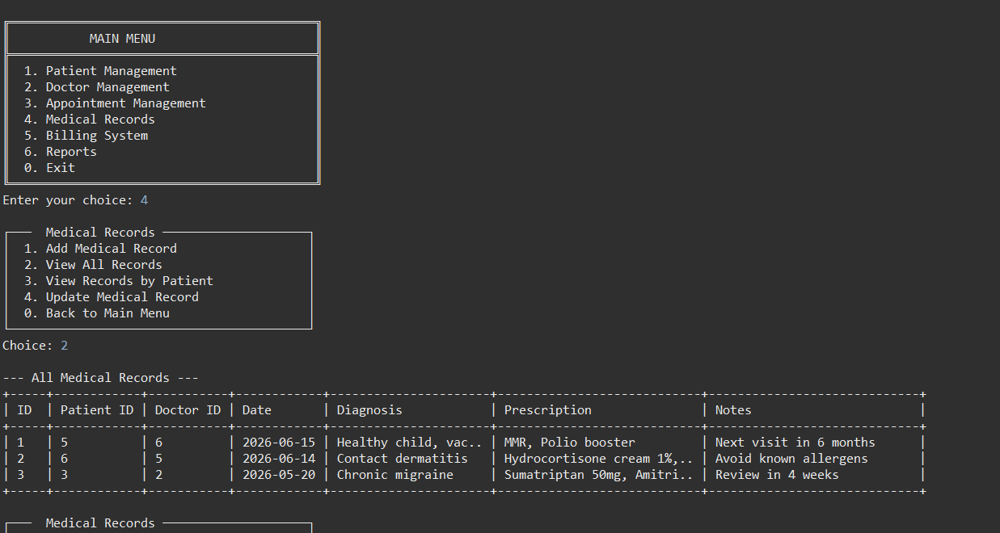 | 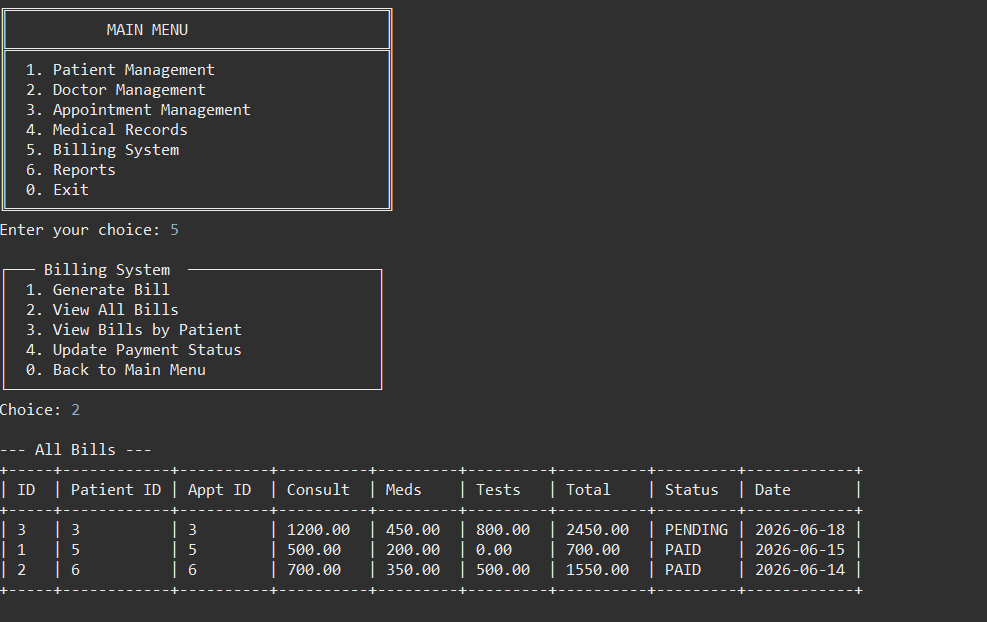 |

|                     Summary Report                    |                      Patient & Doctor Report                      |
| :---------------------------------------------------: | :---------------------------------------------------------------: |
| 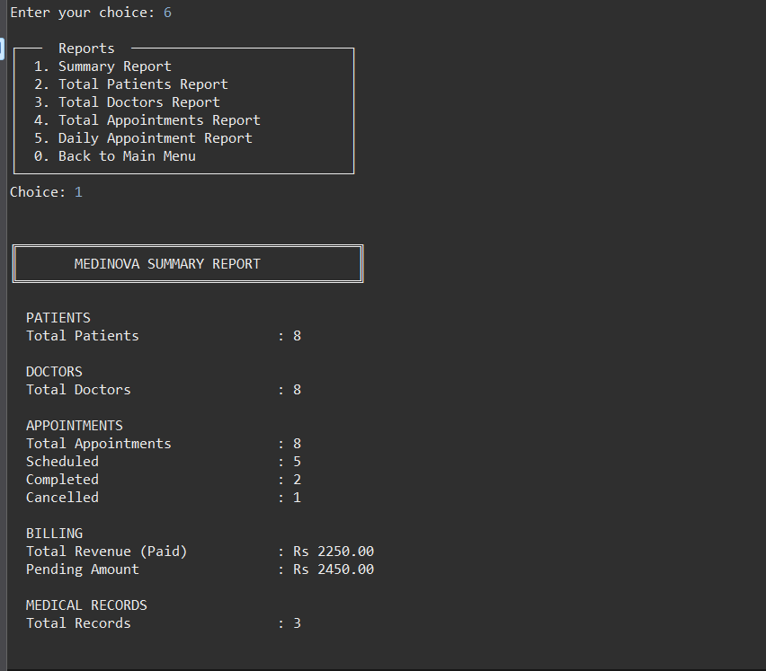 |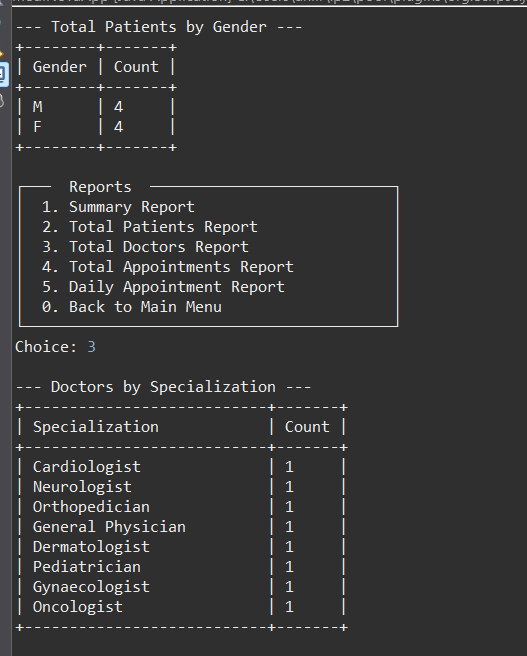 |

|                       Appointment Report                       |                   Analytics Overview                  |
| :------------------------------------------------------------: | :---------------------------------------------------: |
| 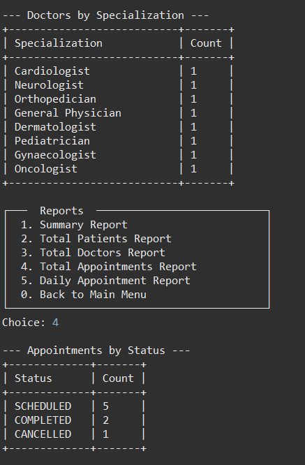 |  |

---

## ✨ Features

| Module | Capability | 
|--------|-----------|
| 🔐 **Admin Authentication** | Secure login with session management | 
| 👤 **Patient Management** | Register, search, update, and discharge patients | 
| 🩺 **Doctor Management** | Manage doctor profiles, specializations, and availability | 
| 📅 **Appointment Scheduling** | Book, reschedule, and cancel appointments | 
| 📋 **Medical Records** | Create and retrieve diagnoses, prescriptions, and notes | 
| 💳 **Billing** | Generate itemized bills with status tracking | 
| 📊 **Reports** | Filtered views of appointments, revenue, and patient data | 

### Feature Highlights

**🔐 Admin Authentication**
- Username/password login guard for all system access
- Session awareness — no unauthenticated operation is possible
- Foundation for future role-based access control (RBAC)

**👤 Patient Management**
- Full CRUD: register new patients, retrieve by ID or name, update demographics, and mark discharged
- Stores name, age, gender, contact, and address
- Queryable patient history linked to appointments and records

**🩺 Doctor Management**
- Doctor profiles with specialization and contact details
- Lookup by ID or specialization filter
- Decoupled from appointments for clean data integrity

**📅 Appointment Scheduling**
- Book appointments linking a patient to a doctor at a specified date/time
- Status lifecycle: `SCHEDULED → COMPLETED → CANCELLED`
- Prevents double-booking through date-time conflict checks

**📋 Medical Records**
- Attach diagnosis and prescription notes to any appointment
- Immutable record creation with retrieval by patient or date range
- Designed for future audit trail support

**💳 Billing**
- Auto-generate bills from completed appointments
- Itemized amount tracking with `PENDING / PAID / CANCELLED` status
- Prepares data structure for insurance and discount extensions

**📊 Reports**
- Daily, weekly, and monthly appointment summaries
- Revenue reports by time period
- Patient visit frequency analysis

---

## 🏛️ Architecture

### System Overview

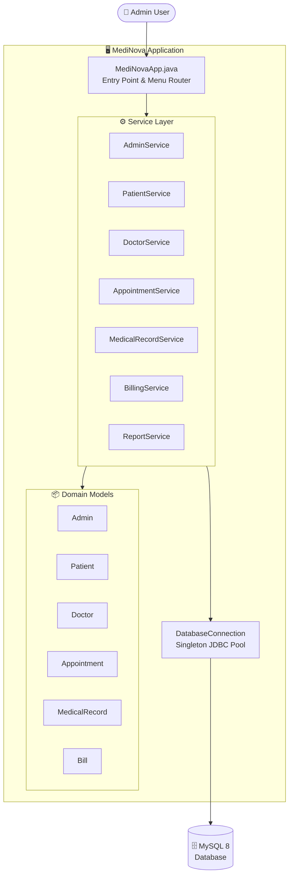

### Design Patterns

**Singleton — `DatabaseConnection.java`**
Ensures a single shared JDBC connection instance across the entire application lifecycle, preventing connection leaks and redundant handshakes.

```java
// Thread-safe, lazy-initialized Singleton
public class DatabaseConnection {
    private static DatabaseConnection instance;
    private Connection connection;

    private DatabaseConnection() { /* init JDBC */ }

    public static DatabaseConnection getInstance() {
        if (instance == null) {
            instance = new DatabaseConnection();
        }
        return instance;
    }
}
```

**Service Layer Pattern**
Business logic is fully isolated in service classes. The `main` class handles only I/O and routing — it never touches SQL directly.

```
MediNovaApp (I/O + Routing)
    └── XxxService (Business Logic + Validation)
            └── DatabaseConnection (Data Access)
```

**Separation of Concerns**
Each layer has one responsibility: models are pure data, services own logic, and the entry point owns presentation. This makes each unit independently testable and replaceable.

---

## 🗄️ Database Schema

### Entity-Relationship Diagram

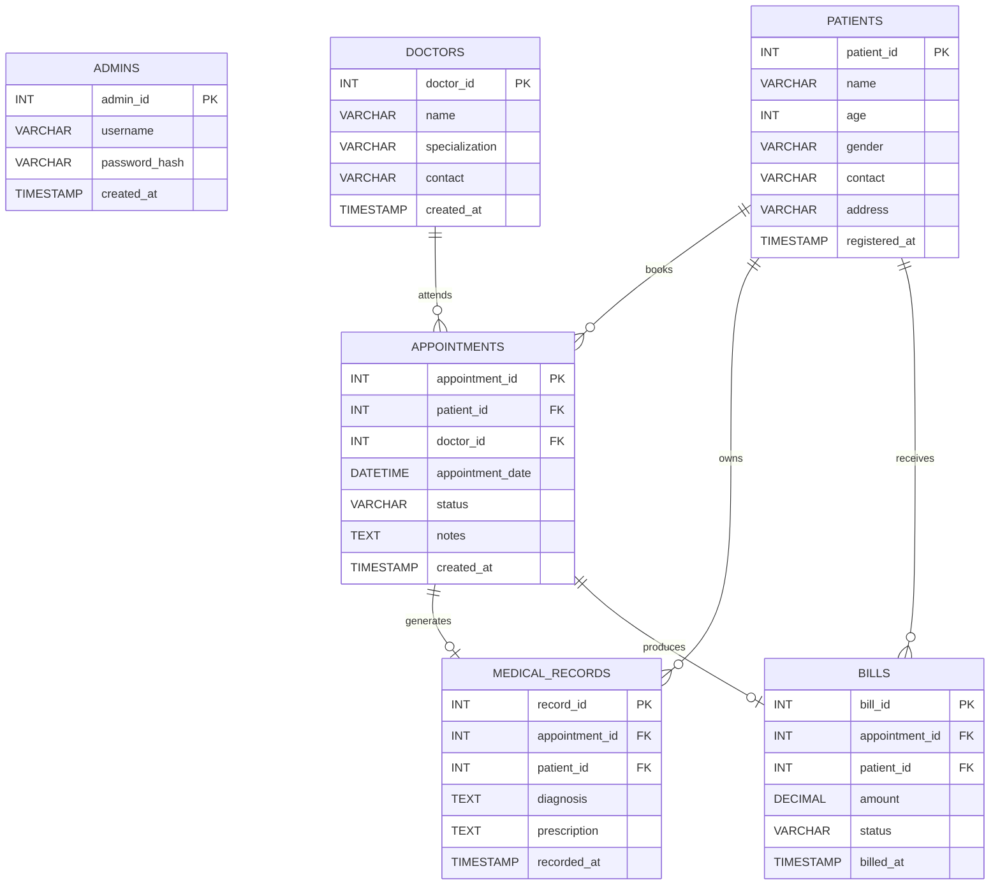

---

## 🚀 Installation

### Prerequisites

| Requirement | Version | Download |
|-------------|---------|----------|
| Java JDK | 21+ | [OpenJDK](https://openjdk.org/) |
| MySQL Server | 8.0+ | [MySQL](https://dev.mysql.com/downloads/) |
| MySQL Connector/J | 8.x | [Connector](https://dev.mysql.com/downloads/connector/j/) |
| Eclipse IDE | 2023-09+ | [Eclipse](https://www.eclipse.org/downloads/) *(optional)* |

### Step-by-Step Setup

**1. Clone the repository**

```bash
git clone https://github.com/YOUR_USERNAME/medinova.git
cd medinova
```

**2. Create the database**

```sql
-- Connect to MySQL
mysql -u root -p

-- Create the database
CREATE DATABASE medinova_db;
USE medinova_db;
```

**3. Run the SQL setup script**

```bash
mysql -u root -p medinova_db < medinova_setup.sql
```

**4. Configure the JDBC connection**

Open `src/com/medinova/database/DatabaseConnection.java` and update:

```java
private static final String URL      = "jdbc:mysql://localhost:3306/medinova_db";
private static final String USERNAME = "root";          // your MySQL user
private static final String PASSWORD = "your_password"; // your MySQL password
```

**5. Add MySQL Connector/J to the classpath**

*In Eclipse:*
- Right-click project → **Build Path** → **Configure Build Path**
- **Libraries** tab → **Add External JARs**
- Select `mysql-connector-j-8.x.x.jar`

*From the command line:*
```bash
javac -cp ".;mysql-connector-j-8.x.x.jar" src/com/medinova/**/*.java
```

**6. Run the application**

*Eclipse:* Run `MediNovaApp.java` as a Java Application.

*Command line:*
```bash
java -cp ".;mysql-connector-j-8.x.x.jar;src" com.medinova.main.MediNovaApp
```

> **Linux/macOS:** Replace `;` with `:` in classpath separators.

---

## 🖥️ Usage Guide

### Login

```
========================================
       Welcome to MediNova
========================================
Username: admin
Password: ********
✔ Login successful. Welcome, admin!
```

### Add a Patient

```
[1] Patient Management
  [1] Register New Patient
  
Enter Name    : Jane Doe
Enter Age     : 34
Enter Gender  : Female
Enter Contact : 9876543210
Enter Address : 12 Main Street, Hyderabad

✔ Patient registered successfully. ID: P-1042
```

### Book an Appointment

```
[3] Appointment Scheduling
  [1] Book Appointment

Enter Patient ID : P-1042
Enter Doctor ID  : D-007
Enter Date/Time  : 2025-08-15 10:30

✔ Appointment booked. Ref: APT-3091
```

### Generate a Bill

```
[6] Billing
  [1] Generate Bill

Enter Appointment ID : APT-3091
Enter Amount         : 1500.00

✔ Bill generated. Bill ID: BILL-0284 | Status: PENDING
```

### View Reports

```
[7] Reports
  [1] Daily Appointment Summary
  
Date: 2025-08-15
Total Appointments : 12
Completed          : 9
Cancelled          : 1
Pending            : 2
Revenue            : ₹18,500.00
```

---

## 📁 Project Structure

```
MediNova/
├── 📄 medinova_setup.sql          # Database schema & seed data
├── 📄 README.md
└── 📂 src/
    └── 📂 com/
        └── 📂 medinova/
            ├── 📂 main/
            │   └── MediNovaApp.java          # Entry point, menu system
            ├── 📂 model/                     # Domain objects (POJOs)
            │   ├── Admin.java
            │   ├── Patient.java
            │   ├── Doctor.java
            │   ├── Appointment.java
            │   ├── MedicalRecord.java
            │   └── Bill.java
            ├── 📂 service/                   # Business logic layer
            │   ├── AdminService.java
            │   ├── PatientService.java
            │   ├── DoctorService.java
            │   ├── AppointmentService.java
            │   ├── MedicalRecordService.java
            │   ├── BillingService.java
            │   └── ReportService.java
            └── 📂 database/
                └── DatabaseConnection.java   # Singleton JDBC connection
```

---

## 🔒 Security

The current implementation uses JDBC Prepared Statements throughout, which prevents SQL injection at the data layer. Below are planned and recommended security enhancements:

| Area | Current State | Improvement |
|------|--------------|-------------|
| **Passwords** | Plaintext storage | BCrypt hashing (`org.mindrot:jbcrypt`) |
| **SQL Injection** | Protected via PreparedStatements | ✅ Already implemented |
| **Access Control** | Single admin role | Role-based access control (RBAC) |
| **Session Tokens** | In-memory session flag | JWT or session token with expiry |
| **Audit Logging** | None | Tamper-evident action log table |
| **Input Validation** | Basic | Bean Validation (JSR-380) |

---

## 🗺️ Roadmap

### Phase 1 — Core Hardening
- [x] Admin authentication
- [x] Patient CRUD
- [x] Doctor CRUD
- [x] Appointment scheduling
- [x] Medical records
- [x] Billing
- [x] Reports
- [ ] Password hashing (BCrypt)
- [ ] Audit logging table
- [ ] Unit tests (JUnit 5)

### Phase 2 — UI Layer
- [ ] JavaFX desktop GUI
- [ ] Dashboard with live statistics
- [ ] Printable appointment slips

### Phase 3 — API & Integration
- [ ] Spring Boot REST API
- [ ] JWT-based authentication
- [ ] Swagger / OpenAPI documentation
- [ ] Postman collection

### Phase 4 — Advanced Features
- [ ] PDF report export (Apache PDFBox)
- [ ] Email/SMS appointment reminders (JavaMail)
- [ ] Insurance management module
- [ ] Inventory & pharmacy management
- [ ] Multi-branch / multi-admin support

---

## 🤝 Contributing

Contributions are welcome. Please follow this workflow:

**1. Fork the repository**

```bash
# Click "Fork" on GitHub, then clone your fork
git clone https://github.com/YOUR_USERNAME/medinova.git
```

**2. Create a feature branch**

```bash
git checkout -b feature/your-feature-name
# Example: feature/add-bcrypt-passwords
```

**3. Commit with clear messages**

```bash
git add .
git commit -m "feat: add BCrypt password hashing to AdminService"
```

**4. Push and open a Pull Request**

```bash
git push origin feature/your-feature-name
```

Then open a Pull Request against `main` with a description of what changes were made and why.

**Commit conventions:** `feat:`, `fix:`, `docs:`, `refactor:`, `test:`

---

## 📄 License

```
MIT License

Copyright (c) 2026 Rathlavath Anil

Permission is hereby granted, free of charge, to any person obtaining a copy
of this software and associated documentation files (the "Software"), to deal
in the Software without restriction, including without limitation the rights
to use, copy, modify, merge, publish, distribute, sublicense, and/or sell
copies of the Software, and to permit persons to whom the Software is
furnished to do so, subject to the following conditions:

The above copyright notice and this permission notice shall be included in all
copies or substantial portions of the Software.

THE SOFTWARE IS PROVIDED "AS IS", WITHOUT WARRANTY OF ANY KIND, EXPRESS OR
IMPLIED, INCLUDING BUT NOT LIMITED TO THE WARRANTIES OF MERCHANTABILITY,
FITNESS FOR A PARTICULAR PURPOSE AND NONINFRINGEMENT.
```

---

## 👤 Author

<div align="center">

**Rathlavath Anil**

*Java Developer | Backend Engineer*

[](https://linkedin.com/in/rathlavathanil/)
[](https://github.com/RathlavathAnil)

</div>

---

<div align="center">

⭐ If MediNova helped you, please consider starring the repository — it helps others find it.

</div>
